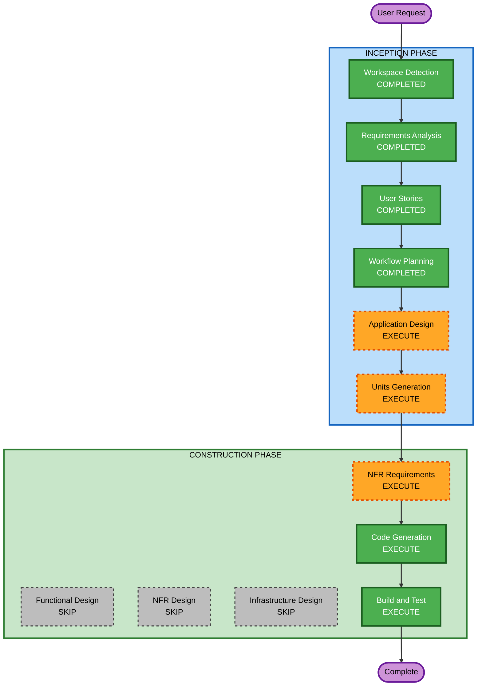

# Execution Plan

## Detailed Analysis Summary

### Change Impact Assessment
- **User-facing changes**: Yes — Developers, PMs, and TLs interact with the Power via natural language in Kiro
- **Structural changes**: Yes — New Kiro Power with dual MCP server architecture
- **Data model changes**: No — No persistent data stores; all state lives in GitHub
- **API changes**: Yes — Custom MCP tools for GitHub Projects V2 GraphQL API
- **NFR impact**: Yes — Security (PAT handling), rate limiting, error handling

### Risk Assessment
- **Risk Level**: Medium — Multiple components (Power config, custom MCP server, hooks, steering), but well-defined scope with clear API boundaries
- **Rollback Complexity**: Easy — Kiro Power can be uninstalled; no persistent state changes
- **Testing Complexity**: Moderate — Requires GitHub API access for integration testing

---

## Workflow Visualization



### Text Alternative
```
Phase 1: INCEPTION
- Workspace Detection (COMPLETED)
- Requirements Analysis (COMPLETED)
- User Stories (COMPLETED)
- Workflow Planning (COMPLETED)
- Application Design (EXECUTE)
- Units Generation (EXECUTE)

Phase 2: CONSTRUCTION
- Functional Design (SKIP)
- NFR Requirements (EXECUTE)
- NFR Design (SKIP)
- Infrastructure Design (SKIP)
- Code Generation (EXECUTE)
- Build and Test (EXECUTE)
```

---

## Phases to Execute

### INCEPTION PHASE
- [x] Workspace Detection (COMPLETED)
- [x] Requirements Analysis (COMPLETED)
- [x] User Stories (COMPLETED)
- [x] Workflow Planning (IN PROGRESS)
- [ ] Application Design - **EXECUTE**
  - **Rationale**: New components needed — must define the custom Projects V2 MCP server, Power structure, steering file responsibilities, and hook architecture. Multiple services with clear boundaries.
- [ ] Units Generation - **EXECUTE**
  - **Rationale**: System decomposes into multiple units: (1) Power configuration package, (2) Custom Projects V2 MCP server, (3) Steering files, (4) Hooks. Each can be developed independently.

### CONSTRUCTION PHASE
- [ ] Functional Design - **SKIP**
  - **Rationale**: Business logic is straightforward (API calls to GitHub). No complex algorithms or state machines. The MCP tools are thin wrappers around GraphQL mutations/queries.
- [ ] NFR Requirements - **EXECUTE**
  - **Rationale**: Security requirements (PAT handling, SECURITY-02/03/05/09/10/12 compliance), rate limiting, error handling patterns, and input validation all need specification.
- [ ] NFR Design - **SKIP**
  - **Rationale**: NFR patterns are standard (env var for secrets, try/catch for errors, input validation). No complex NFR architecture needed — patterns can be applied directly in code generation.
- [ ] Infrastructure Design - **SKIP**
  - **Rationale**: No cloud infrastructure. The Power runs locally within Kiro IDE. MCP servers run as local processes (Docker or npx). No deployment architecture needed.
- [ ] Code Generation - **EXECUTE** (ALWAYS)
  - **Rationale**: Must generate POWER.md, mcp.json, steering files, hooks, and the custom Projects V2 MCP server code.
- [ ] Build and Test - **EXECUTE** (ALWAYS)
  - **Rationale**: Must provide build instructions, test instructions, and validation steps for the Power.

---

## Success Criteria
- **Primary Goal**: A fully functional Kiro Power for GitHub that manages Projects V2 boards and integrates with AIDLC workflow
- **Key Deliverables**:
  - `POWER.md` with frontmatter, onboarding, and steering mappings
  - `mcp.json` with dual server configuration (official GitHub + custom Projects V2)
  - Custom MCP server (TypeScript/Node.js) for Projects V2 GraphQL operations
  - Steering files for project setup, issue management, and board management
  - Kiro hooks for AIDLC automation
- **Quality Gates**:
  - Power installs and activates correctly in Kiro
  - PAT authentication works for both MCP servers
  - Projects V2 operations (create, list, add item, move item) function correctly
  - Hooks fire on appropriate AIDLC events
  - Security Baseline compliance verified
