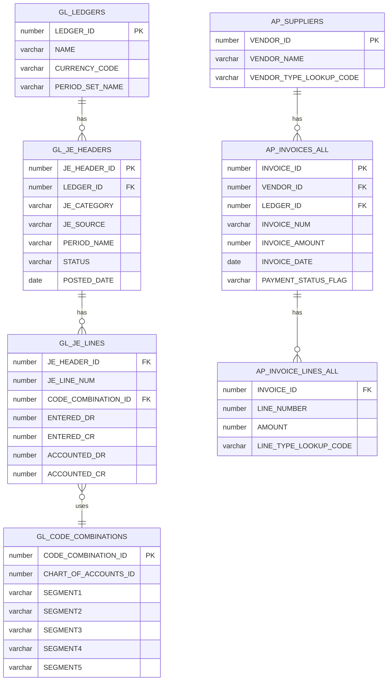
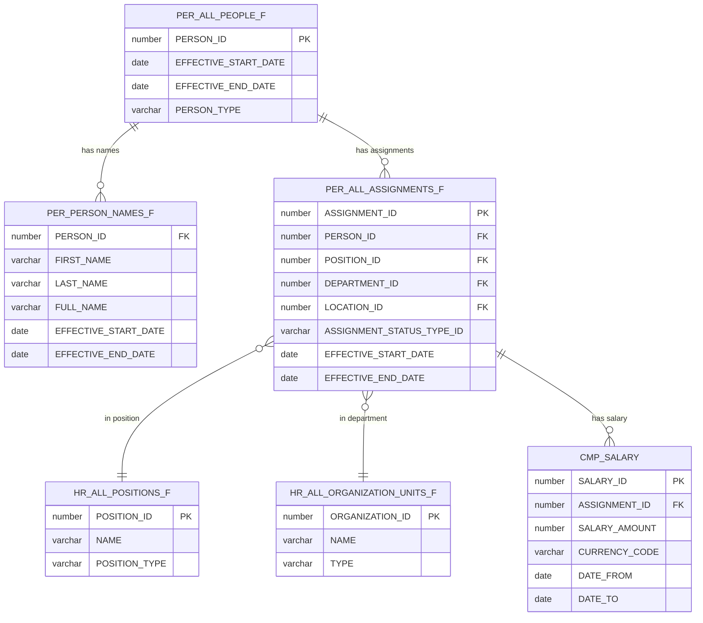

# 04 — Fusion Data Structures

## How Oracle Fusion Organizes Data

### Multi-Org Architecture

```
Business Group (top level)
    └── Legal Entity (LE)
        └── Business Unit (BU)
            └── Ledger (GL)
                └── Operating Unit (OU)
                    └── Inventory Organization (INV)
```

Every transaction in Fusion is stamped with these org identifiers. When extracting data, always include these columns for proper filtering and joining.

### Date-Tracked Tables (Effective Dating)

Many Fusion tables are **date-tracked** — they store history by effective date range:

```sql
-- Example: Person Names table
SELECT *
FROM PER_PERSON_NAMES_F
WHERE PERSON_ID = 12345
  AND EFFECTIVE_START_DATE <= SYSDATE
  AND EFFECTIVE_END_DATE >= SYSDATE;
-- Returns the CURRENT name

-- To get all historical names:
SELECT * FROM PER_PERSON_NAMES_F WHERE PERSON_ID = 12345;
-- Returns multiple rows — one per name change
```

**In BICC extracts:** Date-tracked PVOs return ALL rows (all effective date ranges). You must filter to current records in your transformation layer.

```sql
-- dbt staging model — get current record only
SELECT *
FROM {{ source('fusion_raw', 'person_names_pvo') }}
WHERE EFFECTIVE_END_DATE = '4712-12-31'  -- Oracle's "forever" date
   OR EFFECTIVE_END_DATE >= CURRENT_DATE
```

### Translation Tables (_TL suffix)

Oracle stores multilingual text in separate `_TL` tables:

```
EGP_SYSTEM_ITEMS_B    → Base table (codes, IDs, numbers)
EGP_SYSTEM_ITEMS_TL   → Translation table (descriptions in each language)

Join: B.INVENTORY_ITEM_ID = TL.INVENTORY_ITEM_ID AND TL.LANGUAGE = 'US'
```

**In BICC:** The `EgpItemDescriptionsPVO` handles this join for you.

## Key Finance Data Relationships



## Key HCM Data Relationships



## Flexfields — Custom Data in Fusion

Oracle Fusion uses **Flexfields** to store custom/configurable data:

| Type | Description | Example |
|---|---|---|
| **DFF** (Descriptive Flexfield) | Custom attributes on standard objects | Extra fields on invoices |
| **KFF** (Key Flexfield) | Structured codes (Chart of Accounts) | GL segments |
| **EFF** (Extensible Flexfield) | Complex custom structures | Custom HR attributes |

### Extracting Flexfield Data via BICC

```
Standard PVO: InvoiceHeadersPVO
  → Extracts standard invoice columns

Flexfield PVO: InvoiceHeadersDFFPVO (if configured)
  → Extracts DFF attribute columns
  → Columns named: ATTRIBUTE1, ATTRIBUTE2, ... ATTRIBUTE30
  → Meaning of each ATTRIBUTE column defined in Fusion setup
```

**Important:** Document your flexfield mappings — `ATTRIBUTE1` in one environment may mean something different than in another.

## Segment Values (Chart of Accounts)

For government/public sector, the Chart of Accounts typically has:

```
Segment 1: Fund          (e.g., 1000 = General Fund)
Segment 2: Department    (e.g., 2100 = Finance)
Segment 3: Account       (e.g., 5100 = Salaries)
Segment 4: Program       (e.g., 3001 = Public Safety)
Segment 5: Project       (e.g., 0000 = No Project)
Segment 6: Object        (e.g., 100 = Personnel)
```

These are stored in `GL_CODE_COMBINATIONS` and extracted via `CodeCombinationsPVO`.
