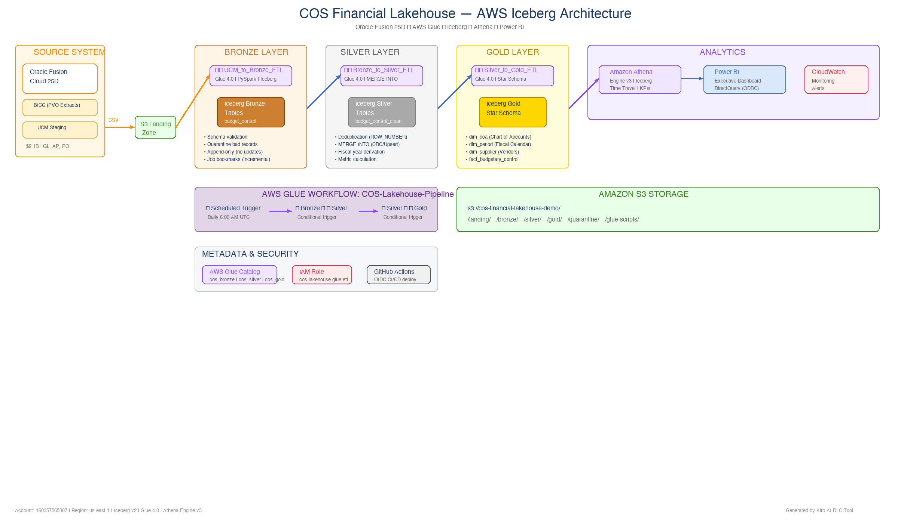

# COS Financial Lakehouse — Complete Technical Guide

## Architecture Diagram



---

## 1. Medallion Architecture — Layer Breakdown

### Bronze Layer (Raw Data)

| Aspect | Detail |
|---|---|
| Purpose | Store raw Oracle Fusion BICC extracts exactly as received |
| Transformations | NONE — append-only, no modifications |
| Data Format | Apache Iceberg (Parquet files on S3) |
| Source | Oracle Fusion 25D → BICC PVO extracts → UCM → S3 landing |
| Glue Job | `COS-UCM-to-Bronze-ETL` |
| Pattern | Append-only (never update or delete) |
| Metadata Added | `bicc_extract_id`, `ingestion_timestamp`, `ingestion_date` |

**What's in Bronze:**
- Raw financial records exactly as Oracle produced them
- Every extract is preserved (full history)
- Duplicates may exist (same record in multiple extracts)
- No business logic applied

---

### Silver Layer (Cleaned & Enriched)

| Aspect | Detail |
|---|---|
| Purpose | Single source of truth — clean, deduplicated, enriched |
| Glue Job | `COS-Bronze-to-Silver-ETL` |
| Pattern | MERGE INTO (upsert: update if exists, insert if new) |

**Transformations applied:**

| # | Transformation | What It Does | SQL/Logic |
|---|---|---|---|
| 1 | Deduplication | Keep only latest record per natural key | `ROW_NUMBER() OVER (PARTITION BY ccid, period ORDER BY last_update_date DESC) = 1` |
| 2 | Fiscal Year Derivation | COS fiscal year: Jul-Jun. JUL-2024 = FY2025 | `CASE WHEN month IN (JUL..DEC) THEN year+1 ELSE year END` |
| 3 | Expenditure Calculation | Set expenditure = actual spend | `actual_amount AS expenditure_amount` |
| 4 | Funds Available | Recalculate to ensure consistency | `budget - actual - encumbrance = funds_available` |
| 5 | NULL Handling | Replace NULL numerics with 0 | `COALESCE(column, 0.0)` |
| 6 | Period Standardization | Uppercase, trim whitespace | `UPPER(TRIM(period_name))` |
| 7 | Audit Timestamps | Track when record entered/updated Silver | `dw_insert_date`, `dw_update_date` |
| 8 | Incremental Processing | Only process new/changed records | Job bookmarks + `ingestion_date` filter |

---

### Gold Layer (Star Schema)

| Aspect | Detail |
|---|---|
| Purpose | Reporting-ready dimensional model for Power BI |
| Glue Job | `COS-Silver-to-Gold-ETL` |
| Pattern | MERGE INTO dimensions + fact table |
| Model | Kimball Star Schema |

**What's built in Gold:**

| Table | Type | Rows | Purpose |
|---|---|---|---|
| `dim_coa` | Dimension | 10-16 | Chart of Accounts: Fund → Department → Account hierarchy |
| `dim_period` | Dimension | 12 | Fiscal calendar: FY2025 (Jul 2024 – Jun 2025) |
| `dim_supplier` | Dimension | 5-10 | Vendor master: name, status, payment terms |
| `fact_budgetary_control` | Fact | 100+ | Budget vs Actual per CCID per period (joined with dims) |

**Gold transformation:** Silver records are joined with dimension tables using surrogate keys (`coa_key`, `period_key`). This enables Power BI to slice data by department name, fund, quarter — without knowing raw Oracle CCIDs.

---

## 2. How to Confirm a Table is Iceberg

Run any of these in Athena:

```sql
-- Method 1: Show table properties
SHOW TBLPROPERTIES cos_gold.fact_budgetary_control;
-- Look for: table_type = ICEBERG

-- Method 2: Query snapshot history (only Iceberg has this)
SELECT * FROM cos_gold."fact_budgetary_control$iceberg_history";

-- Method 3: Query data files metadata
SELECT * FROM cos_gold."fact_budgetary_control$files";

-- Method 4: Query snapshots
SELECT * FROM cos_gold."fact_budgetary_control$snapshots";

-- Method 5: Time travel (only works on Iceberg)
SELECT COUNT(*) FROM cos_gold.fact_budgetary_control
FOR TIMESTAMP AS OF TIMESTAMP '2025-05-08 00:00:00';
```

If any of the `$` metadata queries work — it's Iceberg. Regular Hive tables would error.

---

## 3. Workflow Scheduling & Event Triggers

### Daily Schedule

```
Every day at 6:00 AM UTC
         │
         ▼
    ⏰ COS-Daily-Bronze-Load (SCHEDULED trigger)
         │
         ▼
    COS-UCM-to-Bronze-ETL (Glue Job)
         │
         ├── ✅ SUCCEEDED
         │        │
         │        ▼
         │   ⚡ COS-Bronze-Complete-Start-Silver (CONDITIONAL trigger)
         │        │
         │        ▼
         │   COS-Bronze-to-Silver-ETL (Glue Job)
         │        │
         │        ├── ✅ SUCCEEDED
         │        │        │
         │        │        ▼
         │        │   ⚡ COS-Silver-Complete-Start-Gold (CONDITIONAL trigger)
         │        │        │
         │        │        ▼
         │        │   COS-Silver-to-Gold-ETL (Glue Job)
         │        │        │
         │        │        └── ✅ Pipeline complete. Data in Athena.
         │        │
         │        └── ❌ FAILED → Gold NEVER starts
         │
         └── ❌ FAILED → Silver NEVER starts, Gold NEVER starts
```

### How Triggers Work

| Trigger | Type | Fires When | Starts |
|---|---|---|---|
| `COS-Daily-Bronze-Load` | SCHEDULED | Every day 6 AM UTC (cron) | Bronze ETL job |
| `COS-Bronze-Complete-Start-Silver` | CONDITIONAL | Bronze job state = SUCCEEDED | Silver ETL job |
| `COS-Silver-Complete-Start-Gold` | CONDITIONAL | Silver job state = SUCCEEDED | Gold ETL job |

**Key rule:** Conditional triggers ONLY fire when upstream job = `SUCCEEDED`. If the job is `FAILED`, `TIMEOUT`, or `STOPPED`, the trigger does NOT fire and the pipeline halts.

---

## 4. What Happens When Something Fails

### Failure Scenarios

| Scenario | Impact | Data Safety | Recovery |
|---|---|---|---|
| Bronze job fails | Silver and Gold never run | No data written (Iceberg atomic commit) | Fix issue, re-run Bronze |
| Silver job fails | Gold never runs | Bronze data is safe. Silver may be partially updated (MERGE is atomic per batch) | Fix issue, re-run Silver |
| Gold job fails | No downstream impact | Silver data is safe. Gold may have partial update | Fix issue, re-run Gold |
| S3 data corrupted | Depends on which layer | Iceberg time travel can recover previous state | Rollback to previous snapshot |
| Landing CSV malformed | Bronze quarantines bad records | Good records still processed | Check quarantine folder, fix source |

### Why Failures Don't Corrupt Data

1. **Iceberg atomic commits** — A snapshot is only created if the entire write succeeds. A failed job leaves the table in its previous valid state.
2. **MERGE INTO idempotency** — Re-running Silver or Gold updates existing records (doesn't duplicate them).
3. **Job bookmarks** — Re-running Bronze skips already-processed files (no double-ingestion).

### How to Check What Failed

```bash
# Check last workflow run
aws glue get-workflow-runs --name COS-Lakehouse-Pipeline --max-results 1 \
  --query 'WorkflowRuns[0].{Status:Status,Started:StartedOn,Error:ErrorMessage}'

# Check specific job failure
aws glue get-job-runs --job-name COS-Bronze-to-Silver-ETL --max-results 1 \
  --query 'JobRuns[0].{State:JobRunState,Error:ErrorMessage,Started:StartedOn}'

# View CloudWatch logs
aws logs get-log-events \
  --log-group-name /aws-glue/jobs/output \
  --log-stream-name <job-run-id>
```

### How to Recover

```bash
# Re-run just the failed job
aws glue start-job-run --job-name COS-Bronze-to-Silver-ETL

# Re-run entire pipeline
aws glue start-workflow-run --name COS-Lakehouse-Pipeline

# Rollback Gold to previous snapshot (if bad data got in)
-- In Athena:
-- SELECT * FROM cos_gold."fact_budgetary_control$snapshots" ORDER BY committed_at DESC;
-- Then query the previous good snapshot:
-- SELECT * FROM cos_gold.fact_budgetary_control FOR VERSION AS OF <previous_snapshot_id>;
```

---

## 5. How to Know if Data Fails in S3

### S3 Data Integrity Monitoring

| Check | How | What It Tells You |
|---|---|---|
| Missing landing files | `aws s3 ls s3://bucket/landing/` — check if today's BICC extract arrived | BICC extraction may have failed in Oracle |
| Empty files | Check file size: `aws s3 ls s3://bucket/landing/ --summarize` | Extract ran but produced no data |
| Quarantined records | `aws s3 ls s3://bucket/quarantine/` | Records that failed schema validation |
| Bronze row count drop | `SELECT COUNT(*) FROM cos_bronze.budget_control WHERE ingestion_date = '2025-05-12'` | Today's load may have failed |
| S3 access denied | Check CloudTrail for 403 errors | IAM permissions issue |
| Iceberg metadata corruption | `SELECT * FROM cos_gold."fact_budgetary_control$snapshots"` returns error | Metadata file may be corrupted |

### Automated Monitoring Queries (run daily)

```sql
-- 1. Check today's Bronze ingestion happened
SELECT ingestion_date, COUNT(*) AS rows_loaded
FROM cos_bronze.budget_control
WHERE ingestion_date = CAST(CURRENT_DATE AS VARCHAR)
GROUP BY ingestion_date;
-- If 0 rows → landing data didn't arrive or Bronze job failed

-- 2. Check Silver is up to date
SELECT MAX(dw_update_date) AS last_silver_update
FROM cos_silver.budget_control_clean;
-- If older than today → Silver job didn't run

-- 3. Check Gold fact is current
SELECT MAX(dw_load_date) AS last_gold_load
FROM cos_gold.fact_budgetary_control;
-- If older than today → Gold job didn't run

-- 4. Check for data quality issues
SELECT COUNT(*) AS null_budgets
FROM cos_silver.budget_control_clean
WHERE budget_amount IS NULL OR budget_amount = 0;
-- Should be 0

-- 5. Check row counts match across layers
SELECT 'bronze' AS layer, COUNT(*) AS rows FROM cos_bronze.budget_control
UNION ALL SELECT 'silver', COUNT(*) FROM cos_silver.budget_control_clean
UNION ALL SELECT 'gold', COUNT(*) FROM cos_gold.fact_budgetary_control;
-- Silver ≤ Bronze (dedup removes duplicates)
-- Gold ≤ Silver (only records with matching dimensions)
```

### S3 Event Notifications (automated alerting)

```bash
# Set up S3 event notification → SNS → Email when files arrive (or don't)
aws s3api put-bucket-notification-configuration \
  --bucket cos-financial-lakehouse-demo \
  --notification-configuration '{
    "TopicConfigurations": [{
      "TopicArn": "arn:aws:sns:us-east-1:160357565307:cos-data-alerts",
      "Events": ["s3:ObjectCreated:*"],
      "Filter": {"Key": {"FilterRules": [{"Name": "prefix", "Value": "landing/"}]}}
    }]
  }'
```

### CloudWatch Alarm for Missing Data

```bash
# Alert if no new objects in landing/ for 25 hours (missed daily load)
aws cloudwatch put-metric-alarm \
  --alarm-name "COS-Missing-Landing-Data" \
  --metric-name NumberOfObjects \
  --namespace AWS/S3 \
  --statistic Average \
  --period 86400 \
  --evaluation-periods 1 \
  --threshold 0 \
  --comparison-operator LessThanOrEqualToThreshold \
  --dimensions Name=BucketName,Value=cos-financial-lakehouse-demo Name=StorageType,Value=AllStorageTypes \
  --alarm-actions "arn:aws:sns:us-east-1:160357565307:cos-data-alerts"
```

---

## 6. Summary — Data Protection at Every Layer

| Layer | Protection Mechanism | Recovery Method |
|---|---|---|
| Landing (S3) | S3 versioning enabled | Restore previous version |
| Bronze (Iceberg) | Atomic commits + append-only | Re-run ingestion (bookmarks prevent duplicates) |
| Silver (Iceberg) | MERGE INTO + snapshots | Time travel to previous snapshot |
| Gold (Iceberg) | MERGE INTO + snapshots | Time travel to previous snapshot |
| Quarantine | Separate S3 path | Investigate and re-process |
| Workflow | Conditional triggers stop on failure | Fix and re-run from failed step |
